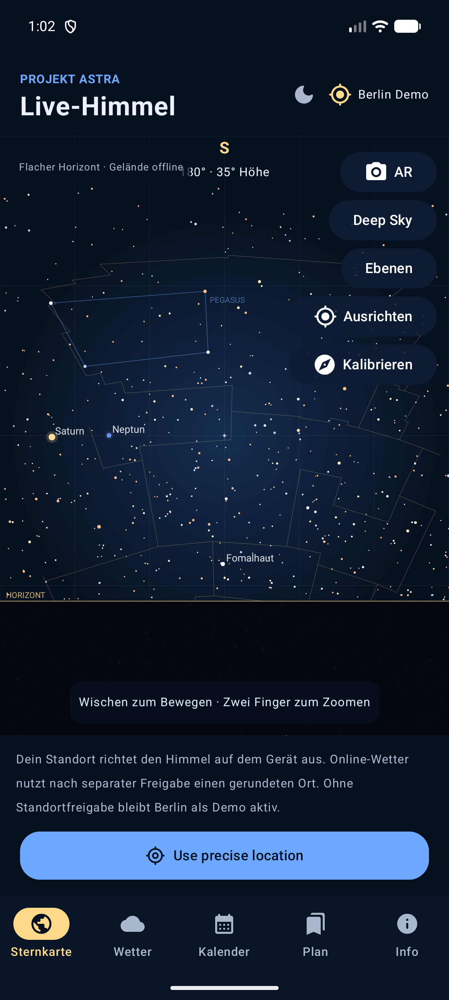

# Projekt Astra

Projekt Astra ist eine persönliche Android-App für die manuelle Sternkarte, eine live ausgerichtete AR-Ansicht, astronomisches Wetter und Beobachtungsplanung.

**Status:** `1.1.6-pre.1` · Version Code `15` · Android 9 / API 28 bis Android 17 / API 37<br>
Der aktuelle Stand ist ein GitHub-Pre-Release zum Testen auf mehreren Geräten: [v1.1.6-pre.1 öffnen](https://github.com/Raeumlichkeit/projekt-astra/releases/tag/v1.1.6-pre.1).



## Funktionen

| Bereich | Enthalten |
| --- | --- |
| Sternkarte | Manuell verschieben und zoomen, sphärische Projektion, Sternfarben, Horizont und 88 IAU-Sternbildgrenzen |
| Himmel | Offline-HYG-Katalog mit 5.041 Sternen, optional 1.016 OpenNGC-Deep-Sky-Objekte, Sonne, Mond und sieben Planeten |
| Milchstraße | Offline gebündelte NASA/Gaia-Darstellung mit natürlichem oder verstärktem Stil und Helligkeitsregler |
| Gelände | Lokales 360°-Profil aus GLO-90-Höhendaten mit Offline-Fallback und Geländeverdeckung |
| Objektinfos | Koordinaten, Helligkeit, Eigenbewegung, zwölfstündige Bahn, Sichtbarkeit und passende DSS2-Aufnahme |
| Suche | Offline-Namen, Alternativnamen, HIP-, Messier- und NGC-Nummern; Treffer direkt zentrieren oder nachführen |
| AR | CameraX-Kamerabild mit lokal berechnetem Sensor-Overlay; Kamera bleibt optional und speichert keine Bilder |
| Wetter | Open-Meteo-Vorhersage, Wolken, Regenwahrscheinlichkeit, Wind, Sicht, Radar- und Wetterkarte |
| Kalender | Meteorschauer, Sonnen- und Mondfinsternisse, lokale Sichtbarkeit sowie Beobachtungsplan und Erinnerungen |
| Licht | NASA-VIIRS-Nachtlichtkarte, numerischer Lichtindex, Bortle-Schätzung und Astra-Score-Abzug |
| Nachtbetrieb | Globaler Rotlichtmodus, dunkles Compose-UI und lokale Favoriten/Beobachtungslisten |

## Neu in 1.1.6-pre.1

Die Sternkarte hat eine eigene Kartenfläche und eine einklappbare Bedienung. Die Vollbildtaste blendet Navigation und Kopfbereich aus; dieselbe Taste oder Androids Zurück-Geste beendet den Modus. **Ansicht zurücksetzen** stellt Süden, 35° Höhe und ein horizontales Sichtfeld von 95° wieder her und beendet das Nachführen.

Das Bedienfeld enthält Suche, Zeitsteuerung, Ebenen, Deep Sky, AR, Ausrichten, Zoom und Rotlicht. Richtung, Sichtfeld sowie Live- oder Simulationszeit bleiben sichtbar. Bedienung und Objektinformationen liegen außerhalb der gezeichneten Himmelsfläche und bleiben bei großer Schrift scrollbar.

Unter **Ebenen & Namen** stehen die Beschriftungsdichten „Wenige“, „Normal“ und „Viele“ zur Verfügung. Ein Layout mit Prioritäten, Randkürzung und Kollisionsprüfung hält ausgewählte Ziele und Orientierungspunkte lesbar. Die Einstellung wird nur lokal gespeichert. Das AR-Sichtfeld folgt dem tatsächlichen CameraX-Ausschnitt, wenn sich die Kartenfläche durch Vollbild oder Bedienung verändert.

Die Zeitsteuerung aus 1.1.5 bleibt verfügbar. Sie bezieht Sternkarte, Planeten, Milchstraße, Sternbildgrenzen und Objektinformationen auf denselben Zeitpunkt; AR bleibt live. Wetter und Wetterkarte sind aktuelle Daten und werden bei Simulationen entsprechend gekennzeichnet.

## Sternkarte bedienen

1. In der normalen Karte mit einem Finger wischen und mit zwei Fingern zoomen. Eine manuelle Bewegung beendet das Nachführen.
2. Das Reglersymbol öffnet die Kartenbedienung. Dort lassen sich Ebenen, Beschriftungen, Deep Sky, Zeit und Ausrichtung einstellen.
3. Mit **Vollbild** erhält die Himmelsfläche mehr Platz. Androids Zurück-Geste oder die Vollbildtaste führt sicher zurück.
4. Ein Objekt antippen, suchen oder aus dem Plan öffnen, um Infos, Zentrieren, Favorit und Nachführen zu verwenden.
5. **AR** nutzt Kamera und Sensoren mit Live-Zeit. Die manuelle Karte bleibt davon getrennt und lässt sich jederzeit wieder öffnen.

Ohne Standortfreigabe zeigt Astra Berlin als deutlich markierten Demo-Standort. Für astronomische Berechnungen wird der Standort lokal verarbeitet.

## Lokal bauen und testen

Voraussetzungen:

- Android Studio mit Android SDK 37
- JDK 17, vorzugsweise die von Android Studio mitgelieferte Runtime
- Android-Gerät oder Emulator ab API 28; Kamera, Kompass und GPS sind optionale Hardware

Debug-APK bauen und auf einem angeschlossenen Gerät installieren:

```powershell
$env:JAVA_HOME = 'C:\Program Files\Android\Android Studio\jbr'
.\gradlew.bat :app:assembleDebug
adb install -r app\build\outputs\apk\debug\app-debug.apk
```

Die wichtigsten Prüfungen:

```powershell
.\gradlew.bat :app:testDebugUnitTest :app:lint
.\gradlew.bat :app:assembleDebugAndroidTest
adb shell am instrument -w de.projektastra.app.test/androidx.test.runner.AndroidJUnitRunner
```

Die Oberfläche läuft im Emulator. Für echte AR-Ausrichtung, Kameraausschnitt, Kompass und GPS sind Tests auf realen Geräten erforderlich. Die aktuellen Gerätetests stehen in [play-store/pre-release-1.1.6.md](play-store/pre-release-1.1.6.md).

Letzter Prüfstand dieses Pre-Releases: 87 JVM-Tests, 19 Android-Instrumentationstests und Lint ohne Befund. Die Test-APK wurde auf dem Android-17-Emulator installiert und ausgeführt; die Prüfung auf echten Geräten bleibt Teil des Pre-Release-Feedbacks.

## Release und Pre-Releases

Jede größere funktionale, technische oder sicherheitsrelevante Änderung wird zuerst als eigener GitHub-Pre-Release mit installierbarer APK, Bundle und Prüfsumme veröffentlicht. Erst nach Tests auf mehreren Geräten, dokumentiertem Feedback und behobenen Blockern folgt ein stabiler Release. Kleine Dokumentations- und rein interne Teständerungen dürfen gesammelt werden. Der vollständige Ablauf steht in [RELEASE_PROCESS.md](RELEASE_PROCESS.md).

Für einen technischen Release-Build:

```powershell
.\gradlew.bat :app:bundleRelease
```

Für eine Veröffentlichung im Play Store müssen zusätzlich ein außerhalb des Repositories gesicherter Upload-Key, eine signierte Bundle-Prüfung, die Datenschutzfreigabe und die [Release-Checkliste](play-store/release-checklist.md) erledigt sein. `bundleRelease` allein ist keine Store-Freigabe.

## Roadmap

Die vollständige, priorisierte Liste steht in [AUFGABEN.md](AUFGABEN.md). Als nächste P1-Schritte sind geplant:

- **P1.5 Lichtverschmutzungskarte:** Legende, Maßstab, Datenalter, Unsicherheit, getrennte Ebenen sowie robuste Offline- und Fehlerzustände.
- **P1.6 Wetteraktualisierung:** alte erfolgreiche Wetterdaten während Pull-to-Refresh sichtbar lassen, Ladeanzeige darüberlegen und Fehler mit Datenalter und Wiederholen anzeigen.
- **P1.7 Startgeschwindigkeit:** Kataloge und Suchindex gestuft beziehungsweise aus dem UI-Thread laden, Caches nutzen und den ersten Kartenrahmen priorisieren.

Nachtplanung, Tagebuch, Instrumenten-Sichtfeld und AR-Zielhilfe folgen unter P2. Akkutests bleiben ausdrücklich P3.

## Daten und Datenschutz

- Der Start, die Sternkarte, Ephemeriden, Suchindex, Favoriten und Beobachtungslisten funktionieren offline.
- GPS wird für Himmels- und Ereignisberechnungen lokal verwendet. Erst nach gesonderter Online-Freigabe erhält der Wetter-/Kartenanbieter einen auf 0,01° gerundeten Ort; das genaue Geländeprofil hat eine weitere Freigabe.
- Kamera- und Bewegungssensoren werden lokal verarbeitet. Es werden keine Kameraaufnahmen gespeichert oder hochgeladen.
- Es gibt kein Konto, keine automatische Cloud-Synchronisierung, keine Suchhistorie und keine automatische Geräte- oder Android-App-Sicherung.
- WebViews deaktivieren Cookies, DOM-Speicher und Browser-Cache. Kartenkacheln liegen in einem privaten, löschbaren Cache.
- Die externen Dienste und Lösch-/Aufbewahrungshinweise stehen in der [Datenschutzerklärung](play-store/privacy-policy.html) und in [THIRD_PARTY_NOTICES.md](THIRD_PARTY_NOTICES.md).

Die Anwendung besitzt keinen Nachweis einer ISO/IEC-27001-Zertifizierung. Diese Norm umfasst neben technischen Kontrollen auch ein organisatorisches Informationssicherheitsmanagement. Prüfstatus und offene Maßnahmen stehen in [SECURITY_REVIEW.md](SECURITY_REVIEW.md) und [SECURITY_REMEDIATION.md](SECURITY_REMEDIATION.md).

## Quellen und Lizenzen

Kataloge und Darstellungen stammen unter anderem aus HYG v4.1, OpenNGC, NASA/Gaia, NASA VIIRS, DSS2, Open-Meteo, RainViewer, OpenStreetMap und Astronomy Engine. Die einzelnen Nutzungsbedingungen, Quellenangaben und mitgelieferten Lizenztexte stehen in [THIRD_PARTY_NOTICES.md](THIRD_PARTY_NOTICES.md), [LICENSES](LICENSES) und [scripts/MILKY_WAY_ASSET.md](scripts/MILKY_WAY_ASSET.md).

Rückmeldungen zum Pre-Release bitte mit Gerätemodell, Android-Version, aktivem Modus (Karte/AR/Rotlicht) und reproduzierbaren Schritten melden. Das Projekt ist zunächst für den persönlichen Gebrauch gedacht.
